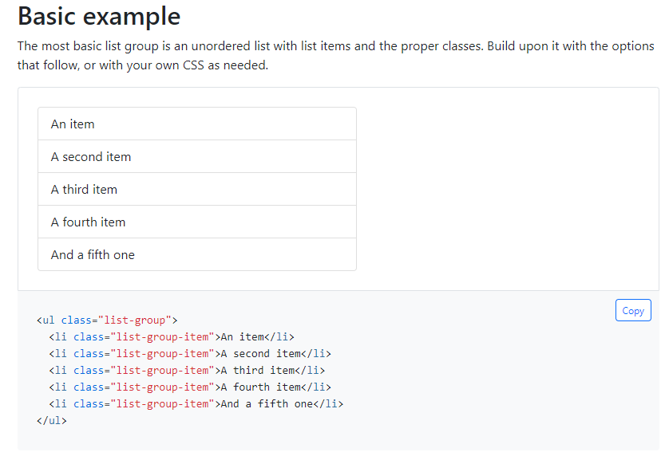

# 元素选择器 

## 概述 
选择器（又名定位器，英文里是selector或者locator）是一种识别网页或桌面应用程序上的元素的方法。  
  
## 选择器相关的概念
 - 选择器表示: 使用json格式来记录选择器，树形结构，从对应的应用信息，窗口信息，多层元素信息，能够精确定位一个页面元素，每一层元素支持通过丰富的属性来做元素定位，适配各种自动化技术，各种应用元素。
- 元素存储库: 存储多个元素选择器的存储文件，一般建议一个应用或者一个网站上的元素保存为一个元素存储库。
- 屏幕截图: 当录制页面元素时，同时会保存相应的屏幕截图，方便后续运维，很容易知道该元素当时在页面的样子。
- 元素属性列表: 用户可以根据应用的实际情况，选择使用特定的属性来做元素的定位属性。
---

## 选择器json schema

选择器是一个json格式的字符串，树形结构，一般选择器由以下几个部分组成：
- 第一层：应用相关信息  
  
| 名称      | 描述 |
| ----------- | ----------- |
| id      |  选择器元素唯一标识符   |
| name      |  选择器元素名称   |
| filePath      |  屏幕截图文件   |
| automationType      |   使用的自动化技术名称  |
| processName      |   进程名称  |
| version      |  选择器版本   |


```
{
	"id": "05174fe5-e54e-4827-867c-80df860a22b2",
	"name": "a_e_booking",
	"filePath": "9d590fa6-9aa1-4281-b86a-7d228692656f.jpg",
    "content": 
    {
		"automationType": "Chrome",
		"processName": {
			"value": "chrome"
		},
		"version": {
			"value": "1.0"
		},
        "child": {下一层元素信息}
    }
}
```
- 第二层：窗口信息

| 名称      | 描述 |
| ----------- | ----------- |
| role      |  窗口控件角色，例如windows， pane， frame   |
| title      |  窗口标题，支持通配符   |
| url      |  对于浏览器窗口，表示页面的网址，支持通配符   |
| className      |   控件类名称  |
| controlMetaType      |   自定义控件类型，例如网页是Page  |

```
{
    "identifier": {
        "role": {"value": "window"},
        "title": {"value": "CARGOeMotion"},
        "url": {"value": "https://cargoemotion.com","excluded": true},
        "className": {"value": "Chrome_WidgetWin_1"},
        "controlMetaType": "Page"
    }，
    "child": {下一层元素信息}
}
```
- 第三层及之后： 元素信息  
```
{
"identifier": {
	"tag": {"value": "A"},
	"class": {"value": "ctl07_12_1","excluded": true},
	"ancestorId": {"value": "ctl07_12n0"},
	"ancestorName": {"value": "form1","excluded": true},
	"ancestorClass": {"value": "ctl07_12_2","excluded": true},
	"isLeaf": {"value": "1","excluded": true},
	"cssSelector": {"value": "body>>tbody>tr>td>a","excluded": true},
	"sInfo": {"value": "E-Booking","excluded": false},
	"tableRow": {"value": "1","excluded": true},
	"tableCol": {"value": "1","excluded": true},
	"href": {"value": "BookingSearchForm.aspx","excluded": true},
	"controlMetaType": "Web",
	"index": {"value": "1","excluded": true},
	"target": {"isCustom": true,"value": "fraRightFrame","operator": "equals","excluded": true}
}
}
```


选择器中的属性用于标识目标元素。attribute value 的运算符默认为 'equals'，我们支持以下运算符：
`equals`, `contains`, `startWith`, `endWith`, `regex`.  
通配符只支持 `equals` 操作符, 例如e `name='test?_node*`. '?' 匹配任意 1 个字符, '*' 匹配0到任意个字符. 复杂字符串匹配， `regex`是更好的选择。 
由于 Swifthorse 支持不同的自动化技术，在选择器schema中定义为不同的属性集合，因此您可以看到每个自动化技术页面中定义的属性：[UIA]（./uia.md）、[MSAA]（./msaa.md）、[web]（./web.md）。

## 选择器中的通配符
当属性使用操作符为 "equals", 支持通配符来匹配值。  
  
|通配符| 功能 |
|-------|----------|
|*    | 匹配0到任意个字符 |
|?    | 匹配任意 1 个字符 |


## 带参数的选择器
选择器属性值 中的参数可以用作参数选择器中属性的值或部分值。用户可以在自动化项目中使用带参数的选择器将参数替换为变量或数据。这允许选择器匹配一系列元素，而不是单个页面元素。 

1. 参数定义形式为 [Mustache style](https://github.com/mustache/mustache.github.com): {{variable}}. 例如:  
`"sInfo": {"value": "{{value}}","excluded": false},`  
或者值的部分内容设置为参数:  
`"sInfo": {"value": "E-Booking{{postfix}}","excluded": false},` 

1. 使用参数选择器的示例  
```python
from swifthorse import swifthorse as sw, locator
# replace variable 'id' in parametric locator during runtime
args = {"id":"test"}
sw.find_element(locator.bing.search_sb_form_q, args)
```

### 示例
以下以网页应用示例说明如何使用参数选择器
测试网站: https://getbootstrap.com/docs/5.1/components/list-group/
  
记录的选择器属性如下:  
```
"identifier": {
    "tag": {"value": "LI"},
	"class": {"value": "list-group-item","excluded": false},
	"isLeaf": {"value": "1","excluded": false},
	"index": {"value": "1","excluded": false}
}
```
 
改动index的value为参数：
```
"identifier": {
    "tag": {"value": "LI"},
	"class": {"value": "list-group-item","excluded": false},
	"isLeaf": {"value": "1","excluded": false},
	"index": {"value": "{{index}}","excluded": false}
}
```

```python
from swifthorse import swifthorse as sw, locator

index = 1
driver = sw.chrome.open("https://getbootstrap.com/docs/5.1/components/list-group/")
while True:
    args = {"index":index}
    if driver.is_existed(locator.getbootstrap.li_anitem, args):
        text = driver.find_element(locator.getbootstrap.li_anitem, args).get_text()
        print(text)
        index += 1
    else:
        break
```